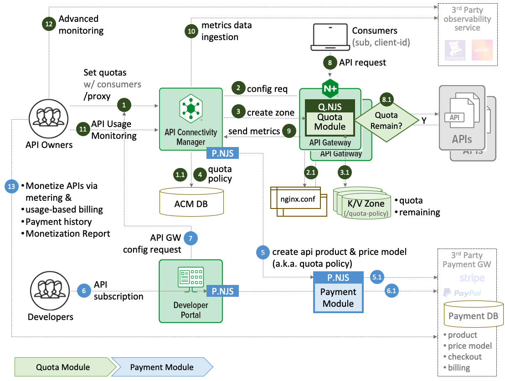
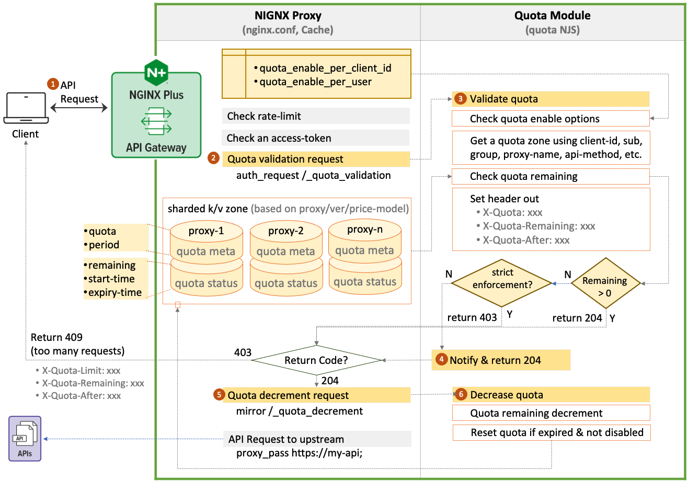
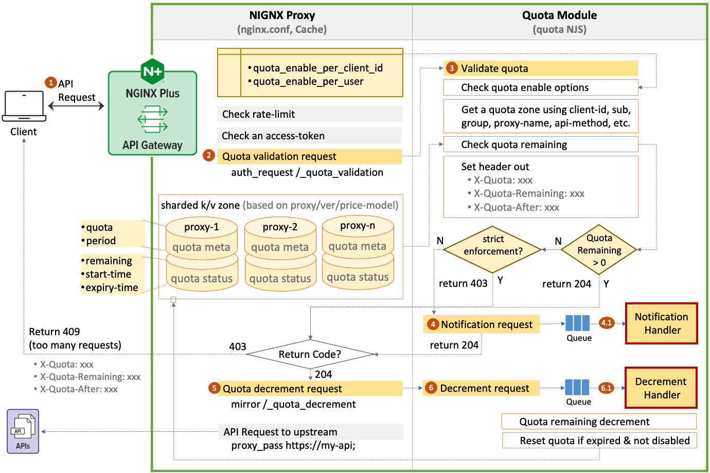

# nginx-api-quotas
NGINX API Quotas Management Core Modules and Examples for NGINX API Gateway and API Connectivity Management

- [Use Cases](#use-cases)
- [Workflow](#workflow)
  - [Setting Quotas on User Basis](#setting-quotas-on-user-basis)
  - [Setting Quotas on Client ID Basis](#setting-quotas-on-client-id-basis)
  - [API Quota Validation & Decrement Flow (Sync)](#api-quota-validation--decrement-flow-sync)
  - [API Quota Validation & Decrement Flow (Async)](#api-quota-validation--decrement-flow-async)
- [APIs](#apis)
- [Capacity Estimation](#capacity-estimation)
  - [Standalone Quotas Cache/Storage](#standalone-quotas-cachestorage)
  - [Distributed Quotas Cache/Storage](#distributed-quotas-cachestorage)

## Use Cases
There are 2 types of rate limiting - short term and long term (quotas), each with different use cases. Short term rate limits are focused on handling bursty traffic, protecting servers and infrastructure from being overwhelmed. Whereas long term quotas are used to measure a consumer’s usage of APIs over a longer period of time (per hour, day or month). Unlike short term rate limits, quotas are not designed to prevent a spike from overwhelming the API service. They are used to regulate API usage ensuring API consumers honor the terms of contract.  

NMS-ACM users want both short term and long term rate limiting. With quota management system, they typically want to

- Block intentional abuse of APIs (scraping, spamming)
- Reduce unintentional abuse while allowing a customer’s usage to burst if needed
- Monetize APIs via metering and usage-based billing
- Enforce API terms of service (ToS) 

## Workflow
API Owners want to limit the number of requests a user can make. They want to set quotas on users and instruct the API gateway to reject requests when the quota limit is reached. 

Quota is similar to rate limit but have longer periods. Example user can have 10,000 requests to the API per month. 

**Summary of workflow:**

1. API owner can set the quota on a per user basis

2. Quotas are set at the API level. Access to any endpoint in the API decrements the count

3. When users quota exceeds the limit, the API gateway can be configured for either of the scenarios below

   3.1 strict enforcement (reject requests) or 

   3.2 handle requests over the usage limit (monitor and notify) 

4. Quotas can be reset

5. Quotas can be disabled

6. Headers related to limits can be sent back to client (remaining usage etc)

> **Notes:**
> 
> Checking for quota is expensive. Maintaining counters for each user is even more expensive. Suggest to look into event driven approach

### Setting Quotas on User Basis

### Setting Quotas on Client ID Basis

### API Quota Validation & Decrement Flow (Sync)

### API Quota Validation & Decrement Flow (Async)

### Out of Scopes

- [NGINX Serverless Payment Gateway](https://github.com/nginx-payment-connect)
- [NGINX BYO Payment Gateway](https://github.com/nginx-payment-connect/nginx-byo-pay)

## APIs

## Capacity Estimation

This estimate focuses on API gateway for the quota validation and decrement. Find the following recommendation of when to use standalone or distributed cache/storage:

### Standalone Quotas Cache/Storage
- **Use cases when :**
  - number of proxies: 1K ~ 10K
  - number of quotas: 15K ~ 150K
  - number of consumers: ~ 100K
  - number of concurrent requests: 1 ~ 1024ea
- **System specification recommendation:**
  - memory: 30GB ~ 300GB
  - storage: 30GB ~ 300GB
  - network: 20Mbps ~ 200Mbps

### Distributed Quotas Cache/Storage
- **Use cases when :**
  - number of proxies: over 10K
  - number of quotas: over 150K
  - number of consumers: over 100K
  - number of concurrent requests: over 1024ea
- **System specification recommendation:**
  - Use distribute cache/storage machines
  - memory, storage, network : upto the following estimation

> **Note**: This doesn't include application's API data to focus on quota data capacity so that you would need to additionally estimate your business data to determine the system specification.

## Examples
- API quota per user on a single API gateway

## Misc.
- [Additional Considerations](./docs/nginx-quota-limit.md)
